# Qure AI  
*AI + Quantum Computing for Accelerated Drug Discovery Against Meningitis*

---

## Project Overview
**Qure AI** is a hybrid **AI + Quantum** pipeline designed to discover and validate potential drug molecules targeting the bacteria that cause **meningitis**.  

- **AI/ML Component**: A machine learning model (Support Vector Machine) is trained on molecular datasets (sourced from **ChEMBL**) to identify effective drug candidates. We also use generative AI to propose **novel SMILES strings** as potential cures.  
- **Quantum Component**: The **Variational Quantum Eigensolver (VQE)** algorithm is applied to calculate molecular ground-state energies. Lower energies indicate greater molecular stability, providing a validation step for both existing and AI-generated molecules.  

This project demonstrates the **synergy of machine learning and quantum simulation** for next-generation drug discovery.

---

## Motivation
Meningitis remains a **critical global health burden**:  
- Every year, **236,000 people die** of meningitis.  
- Over **2 million new cases** are diagnosed annually.  
- That’s **1 death every 2 minutes** and **1 diagnosis every 15 seconds**.  
- **1 in 5 survivors** live with permanent disabilities (brain damage, limb amputations, kidney failure).  
- Within **1–2 years**, the majority of antibodies decrease rapidly.  

By integrating AI and quantum computing, **Qure AI** aims to accelerate drug discovery and validation, potentially reducing timelines and costs compared to traditional wet-lab methods.

---

## Target Bacteria
We studied molecules that attack **four major bacterial pathogens** responsible for meningitis:  
- *Neisseria meningitidis*  
- *Streptococcus pneumoniae*  
- *Haemophilus influenzae*  
- *Streptococcus agalactiae*  

---

## Dataset
- **Source**: [ChEMBL Database](https://www.ebi.ac.uk/chembl/)  
- **Features used**:  
  - SMILES strings  
  - Molecular weight  
  - MIC (Minimum Inhibitory Concentration)  
  - MBC (Minimum Bactericidal Concentration)  
  - Selective Ratios  
  - IZ (Inhibition Zone)  
  - IC50 values  
  - Log10CFU  
  - AlogP  
  - Lipinski’s Rule of 5  

---

## Machine Learning Component
- **Model Used**: Support Vector Machine (SVM)  
- **Objective**: Classify molecules as effective/ineffective against target bacteria  
- **Generative AI**: Produce **novel SMILES molecules** with drug-like properties  

---

## Quantum Validation (VQE)
- **Framework**: Qiskit + PySCF  
- **Process**:  
  1. Convert molecules into Hamiltonians  
  2. Run **Variational Quantum Eigensolver (VQE)**  
  3. Compare ground-state energies  
- **Interpretation**:  
  - **Lower energy → more stable molecule**  
  - Validates both **existing** and **AI-generated** molecules  

---

## Pipeline Workflow

```mermaid
flowchart TD
    A[📂 Clean Dataset] --> B[🤖 Train SVM Model on Molecular Features]
    B --> C[⚛️ Run VQE Simulation for Quantum Validation]
    C --> D[🧬 Generate Novel Molecules via AI]
    D --> E[📊 Compare Novel vs Existing Molecules]
    E --> F[✅ Validate Stability using Energy Levels]
```

---

## Tech Stack
- **Languages**: Python, HTML, CSS
- **Libraries**: Qiskit, PySCF, Pandas, RDKit, NumPy, scikit-learn, Matplotlib, three.js, chart.js, vanta.js

---

## Results

The VQE quantum simulation results demonstrate successful energy convergence for both existing and AI-generated molecules:

  
  

  <em><strong>(a) Existing Molecule (Cefotaxime sodium)</strong> &nbsp;&nbsp;&nbsp;&nbsp;&nbsp;&nbsp;&nbsp;&nbsp;&nbsp;&nbsp;&nbsp;&nbsp;&nbsp;&nbsp;&nbsp;&nbsp;&nbsp;&nbsp;&nbsp;&nbsp;&nbsp;&nbsp;&nbsp;&nbsp;&nbsp;&nbsp;&nbsp;&nbsp; <strong>(b) AI-Generated Molecule</strong></em>

### Key Findings
- The generated molecule is **1.98x** more stable than existing molecule
---

## References
